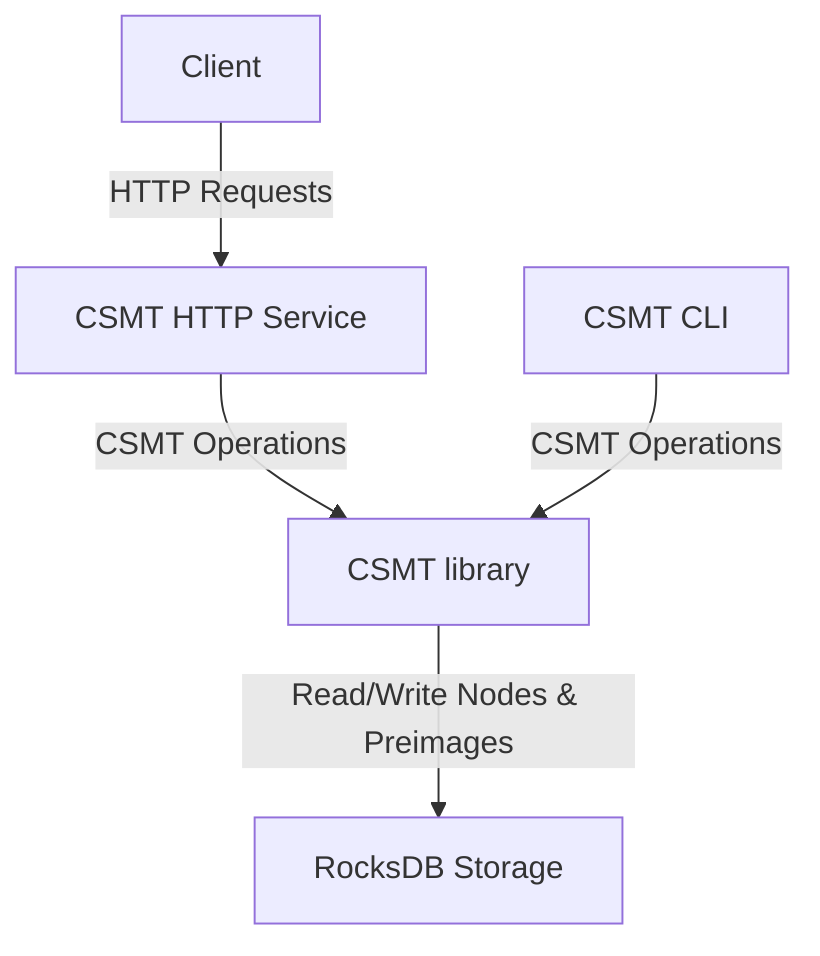
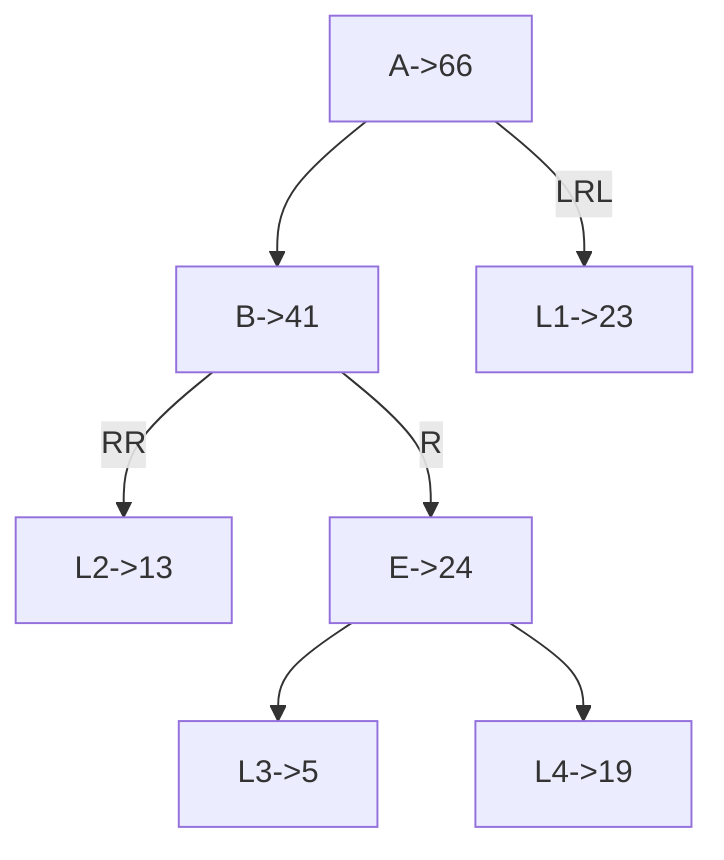

# Architecture

## System Overview

A CSMT instance consists of:

- A RocksDB storage backend for persisting tree nodes and preimages.
- A Haskell library implementing the CSMT data structure and its operations.
- An HTTP service exposing the CSMT functionalities via a RESTful API.

NOTE: The HTTP layer is not done yet.

## Storage Layer

The storage layer is responsible for persisting the CSMT nodes and preimages. It uses RocksDB as the underlying storage engine, providing efficient read and write operations.

### Nodes

The CSMT nodes are stored at some prefixes of the yes and their value is either
- an infix of all children keys and hash of a combination of the left and right child after the `prefix + infix`
- a suffix of a keys and its value hash

In our example we use the following schema:

| symbol | example  | reality                  |
| ------ | -------- | ------------------------ |
| L      | 0        | 0                        |
| R      | 1        | 1                        |
| H      | identity | blake2b256               |
| +      | sum      | bytestring concatenation |

NOTE: Using the sum which is a commutative monoid is really not acceptable for a production system, because we would get same root for different trees, but it makes the example easier to read.

NOTE:
not all the bits are explicitly part of infixes or suffixes, in particular because a node has always 2 children the bit after the infix is implicitely an L for the left child and R for the right child.

Mapping keys to bytestring is necessary to encode them in the hashing function.

For the example we use its binary value directly. So

| Key Path | Binary | Integer |
| -------- | ------ | ------- |
| L        | 0      | 0       |
| R        | 1      | 1       |
| LL       | 00     | 0       |
| LR       | 01     | 1       |
| RL       | 10     | 2       |
| RR       | 11     | 3       |
| LLR      | 001    | 1       |
| ...      | ...    | ...     |

Let's say we are storing the following facts:

| Key Path | Value |
| -------- | ----- |
| LLRR     | 13    |
| LRRL     | 5     |
| LRRR     | 19    |
| RLRL     | 23    |

In the database we will have the following entries:

| Partial Key | Hashing            | Computation     | Value | Infix | Reference |
| ----------- | ------------------ | --------------- | ----- | ----- | --------- |
|             | H(B + LRL + L1)    | 41 + 2 + 23     | 66    |       | A         |
| L           | H(RR + L2 + R + E) | 3 + 13 + 1 + 24 | 41    |       | B         |
| LR          | H(L3 + L4)         | 19 + 5          | 24    | R     | E         |
| LLRR        |                    | 13              | 13    | RR    | L2        |
| LRRL        |                    | 5               | 5     |       | L3        |
| LRRR        |                    | 19              | 19    |       | L4        |
| RLRL        |                    | 23              | 23    | LRL  | L1        |

### Preimages

The preimages of the hashes stored in the CSMT are also stored in RocksDB, allowing for retrieval and verification of the original data associated with each key.
